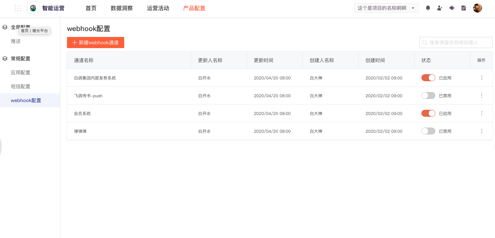

# Webhook 通道对接

## 创建入口 

1.进入`智能运营`平台 

2.点击顶导航中的 `产品配置` 

3.点击侧边导航的 `webhook 配置` 

4.点击 `新建 webhook` 通道



## HTTP 请求

### Request 验证

一些场景下，客户需要验证 Webhook 请求是来自GIO而不是第三方伪造，可为 Webhook 配置一个 Secret Key，该 Secret Key 在GIO运营服务端和客户的服务器上共享。

对于配置了Secret Key的可以生成消息签名来验证消息的合法性和完整性，未配置的默认用空字符串作为Secret Key。

```text
/**
 * java生成签名示例
 */
import com.google.gson.Gson;
import org.apache.commons.codec.digest.HmacUtils;

String sign(Map<String, String> payload, String secret) {
    String str = new Gson().toJson(payload);
    return new HmacUtils(HmacAlgorithms.HMAC_SHA_256, secret).hmacHex(new Gson().toJson(str));
}
```

生成的签名放置在http响应头 X-gio-signature 中，例如：

`X-gio-signature:1e089260ba1bfde37f88eca8e665d8b1fb690ae763979d25dd10a831dedd52a8`

可参考秘钥计算的代码：[https://github.com/growingio/growing-webhook-demo](https://github.com/growingio/growing-webhook-demo) 

### Request Body

<table>
  <thead>
    <tr>
      <th style="text-align:left"><b>&#x7C7B;&#x578B;</b>
      </th>
      <th style="text-align:left"><b>Key &#x914D;&#x7F6E;&#x5904;</b>
      </th>
      <th style="text-align:left"><b>&#x503C;&#x914D;&#x7F6E;</b>
      </th>
      <th style="text-align:left"><b>&#x503C;&#x83B7;&#x53D6;&#x65B9;&#x5F0F;</b>
      </th>
      <th style="text-align:left"><b>&#x8BF4;&#x660E;</b>
      </th>
    </tr>
  </thead>
  <tbody>
    <tr>
      <td style="text-align:left">&#x7528;&#x6237;&#x5C5E;&#x6027;</td>
      <td style="text-align:left">
        <p>&#x4EA7;&#x54C1;&#x914D;&#x7F6E;&#x9875;&#x9762;</p>
        <p>&#x4FA7;&#x8FB9;&#x680F;&#xFF1A;Webhook&#x914D;&#x7F6E;</p>
      </td>
      <td style="text-align:left">&#x4E0D;&#x9700;&#x8981;&#x914D;&#x7F6E;</td>
      <td style="text-align:left">&#x4ECE;&#x5BF9;&#x5E94;&#x7684;&#x7528;&#x6237;&#x5C5E;&#x6027;&#x4E2D;&#x83B7;&#x53D6;</td>
      <td
      style="text-align:left"></td>
    </tr>
    <tr>
      <td style="text-align:left">&#x81EA;&#x5B9A;&#x4E49;&#x53C2;&#x6570;</td>
      <td style="text-align:left">
        <p>&#x4EA7;&#x54C1;&#x914D;&#x7F6E;&#x9875;&#x9762;</p>
        <p>&#x4FA7;&#x8FB9;&#x680F;&#xFF1A;Webhook&#x914D;&#x7F6E;</p>
      </td>
      <td style="text-align:left">&#x8FD0;&#x8425;&#x6D3B;&#x52A8;&#x540D;&#x79F0;</td>
      <td style="text-align:left">&#x4ECE; &#x89E6;&#x70B9;&#x8FD4;&#x56DE;&#x503C;&#x4E2D;&#x83B7;&#x53D6;</td>
      <td
      style="text-align:left"></td>
    </tr>
  </tbody>
</table>

### Response Code

GIO 会遵循HTTP状态码，如果目标地址返回 200 代表post成功，其余的都是错误信息。

### Request Header

```text
Content-Type:application/json
X-gio-signature:xxx
```


### Request Body

#### 正式发送的 webhook 请求

发送速率为每秒 **1000** 个用户的信息

在 growingio 的页面上能配置若干模板参数，

例如：

```text
{
  "name": "webhook名称",
  "templateParam": { // 运营同学填写的模板参数值
    "campaignType": "双十一",
    "campaignDate": "2020-04-29"
  },
  "userAttr": [ //每个用户的属性值查出结果后和填充完的文本一起发送
    {
      "name": "user1",
      "age": "12",
      "content": "user1,12,hello"
    },
    {
      "name": "user2",
      "age": "10",
      "content": "user2,10,hello"
    }
  ],
  "timestamp": "15xxxx" //时间戳
}
```

如果不查询用户属性，userAttr字段为空数组：

```text
{
  "name": "webhook名称",
  "templateParam": { // 运营同学填写的模板参数值
    "campaignType": "双十一",
    "campaignDate": "2020-04-29",
    "content": “hello,world”
  },
  "userAttr":[]
  "timestamp": "15xxxx" //时间戳
}
```

#### 测试 webhook 配置

Request Body

```text
{
  "name": "webhook名称",
  "templateParam": { // 运营同学填写的模板参数值
    "campaignType": "双十一",
    "campaignDate": "2020-04-29"
  },
  "userAttr": [ //每个用户的属性值查出结果后和填充完的文本一起发送
    {
      "name": "user1",
      "age": "12",
      "content": "user1,12,hello"
    }
  ],
  "timestamp": "15xxxx" //时间戳
}
```

如果不查询用户属性：

```text
{
  "name": "webhook名称",
  "templateParam": { // 运营同学填写的模板参数值
    "campaignType": "双十一",
    "campaignDate": "2020-04-29",
    “content”: "hello, world"
  },
  "userAttr":[]
  "timestamp": "15xxxx" //时间戳
}
```

## 测试 Webhook

Request Body

```text
{
  "name": "webhook名称",
  "templateParam": { // 运营同学填写的模板参数值
    "campaignType": "双十一",
    "campaignDate": "2020-04-29"
  },
  "userAttr": [ //每个用户的属性值查出结果后和填充完的文本一起发送
    {
      "name": "user1",
      "age": "12",
      "content": "user1,12,hello" // 测试webhook配置的场景中不填写用户属性，只填写简单文本内容
    }
  ],
  "timestamp": "15xxxx" //时间戳
}
```

如果不查询用户属性:

```text
{
  "name": "webhook名称",
  "templateParam": { // 运营同学填写的模板参数值
    "campaignType": "双十一",
    "campaignDate": "2020-04-29",
    "content": "hello,world"
  },
  "userAttr":[]
  "timestamp": "15xxxx" //时间戳
}
```

目前webhook只支持http请求。


