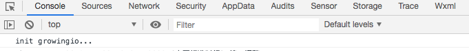

# 小程序调试指南

### 1.1 成功集成无埋点SDK

触达SDK依赖无埋点的集成, 所以需要先确保无埋点sdk集成成功，具体集成方法可以查看

[https://docs.growingio.com/docs/developer-manual/sdkintegrated/other-sdk/minp-sdk](https://docs.growingio.com/docs/developer-manual/sdkintegrated/other-sdk/minp-sdk)

集成成功后可看到控制台中有打印内容如下：init growingio...，如图所示

### 1.2 成功集成触达SDK

### 集成文档可以查看

[https://docs.growingio.com/mp/developers/integrations/minp-sdk](https://docs.growingio.com/mp/developers/integrations/minp-sdk)

**弹窗集成检查**

1）弹窗集成后可以看到控制台中有打印内容如下： Marketing ，如图所示

2）启动会发起向[https://messages.growingio.com/](https://messages.growingio.com/v1/9c76fe4756c3404d/notifications?url_scheme=wx54e0f3a957bead9e&u=585978dc-d1ed-4bef-8ff4-846c301509c2)发起请求。如果没有发起请求，请确定用户页面中是否加入了&lt;gio-marketing /&gt;

gio-marketing 集成成功！初始化中…

**banner 集成检查**

gio-banenr 代码已引入，请继续使用的方式引入组件

gio-banner 集成成功，初始化中…

