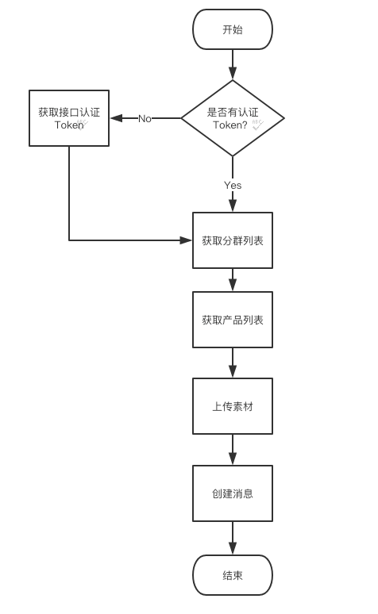

# 弹窗API

## 1. 概述

为满足广大客户更灵活创建弹窗的诉求，GrowingIO 提供了一套创建弹窗的API。本文档旨在说明一些调用流程，逻辑及相关接口说明。

## 2. 认证

为保证数据安全，GrowingIO所有的API服务，请求Head中需要携带 Token。

Token 获取详见：[GrowingIO接口认证](https://docs.growingio.com/v3/product-manual/projectmange/projectmange/api-token)

获取到 Token 后所有的 HTTP 请求头都需要带上 X-Client-Id 和 Authorization，具体如下：

| 名称            | 类型     | 描述                                     | 示例                            |
| ------------- | ------ | -------------------------------------- | ----------------------------- |
| X-Client-Id   | string | GrowingIO分配的公钥，请在GrowingIO后台“项目配置”页面获取 | X-Client-Id: 123abc           |
| Authorization | string | 认证后获取到的Token                           | Authorization: {替换成获取到的Token} |

例子：

```swift
X-Client-Id: 7f8it37dxdt91x4n5cvuvccc1cgaqe21
Authorization:  EcWylTb23T5yoNMkna51VsyVfGovQHMVc1neljuK5TpqNTz9U5c9Z2BYZLUos244
```

## 3. 使用注意

1. 接口调用频率限制：单个 Token 调用限制 1200次/分钟。
2. 项目UID 指的是访问项目的时候，页面 URL 以 /projects/:project\_uid 开头，例如 https://www.growingio.com/admin/projects/nxog09md/dashboard 中的 "nxog09mx"。
3. 创建站内消息需要使用分群作为目标用户，分群获取接口参考文档：[获取分群列表](https://docs.growingio.com/docs/developer-manual/api-reference/statistics-api/definition/get-segm)
4. 创建消息需要指定对应应用的 ID，通过以下接口获得（请求Head中均需要携带Token ）

```aspnet
GET https://www.growingio.com/api/v1/projects/项目UID/meta/products
```

返回字段：

| 字段名         | 类型     | 说明                   | 示例               |
| ----------- | ------ | -------------------- | ---------------- |
| id          | string | 产品编号                 | GQPDxPNm         |
| name        | string | 名字                   | GrowingIO测试产品    |
| displayName | string | 产品显示名称，展示在deeplink页面 | gio              |
| activated   | bool   | 是否有效                 | true             |
| spn         | string | spn                  | www.gioee.com    |
| urlScheme   | string | 产品的URL Scheme        | 8137d31f4e7b819f |
| platform    | string | 平台                   | iOS              |
| createdAt   | long   | 创建时间                 | 1522019721098    |

5\. 创建站内消息需要先上传素材到GrowingIO服务，参素材上传接口

6\. 接口调用流程：



## 4. 接口说明

### 接口：素材上传

URL：`https://www.growingio.com/api/v1/projects/:project_uid/meta/marketing_medias`

方法：POST

请求对象：

| 字段名  | 类型  | 说明             |
| ---- | --- | -------------- |
| file | 字符串 | 图片base64编码后的值。 |

请求示例：

```c
Headers: 
Content-Type: application/json
X-Client-Id: 7f8it37dxdt91x4n5cvuvccc1cgaqe22
Authorization: EcWylTb23T5yoNMkna51VsyVfGovQHMVc1

Request Body:
{
  "file":"data:image/jpeg;base64,......."
}
```

返回示例：

```c
{
 "url":"https://statics.growingio.com/media/20190813/3/1565873249372/test.jpeg"
 }
```

### 接口：创建消息

URL：`https://www.growingio.com/api/v1/projects/:project_uid/meta/marketing_in_app_messages`

方法**：**POST

请求对象：

| 字段名      | 类型  | 是否必填 | 说明                                                                                                                      |
| -------- | --- | ---- | ----------------------------------------------------------------------------------------------------------------------- |
| name     | 字符串 | 是    | <p>消息名称。建议使用业务含义名称+时间戳，不可重复，便于在管理后台查看使用。</p><p>示例：用户召回弹窗20190716170520</p>                                              |
| audience | 字符串 | 是    | <p>目标人群。</p><p>分群：分群 id</p><p>访问用户：visitors</p><p>新访问用户：newVisitors</p><p>登陆用户：loginUsers</p><p>新登录用户：newLoginUsers</p> |
| rule     | 对象  | 是    | 消息触发规则配置。                                                                                                               |
| state    | 字符串 | 否    | <p>activated：上线（默认）</p><p>draft：草稿</p><p>stop：下线</p><p>archived：归档</p>                                                  |
| content  | 对象  | 是    | 消息素材，图片的地址。                                                                                                             |

rule

| 字段名       | 类型   | 是否必填 | 说明                                      |
| --------- | ---- | ---- | --------------------------------------- |
| targets   | 对象数组 | 是    | 指定产品和跳转页面的关系。                           |
| action    | 字符串  | 是    | <p>打开应用：appOpen</p><p>自定义埋点事件：事件key</p> |
| limit     | 数字   | 是    | 本条消息最大展示次数。                             |
| startAt   | 数字   | 否    | 预约上线起始时间，unix时间戳                        |
| endAt     | 数字   | 否    | 预约下线时间unix时间戳                           |
| triggerCd | 数字   | 否    | 本条消息展示间隔，单位秒。                           |

targets里每个target的结构：

| 字段名        | 类型  | 是否必传 | 说明                                                                                                                                             |
| ---------- | --- | ---- | ---------------------------------------------------------------------------------------------------------------------------------------------- |
| productId  | 字符串 | 是    | 产品ID，从上面的产品信息接口获取                                                                                                                              |
| type       | 字符串 | 是    | <p>点击转跳链接类型。</p><p>打开网页：“openH5”</p><p>打开应用内具体页面：“openUrl”</p><p>自定义参数：“custom”</p>                                                            |
| url        | 字符串 | 是    | <p>点击跳转路径。网页需要制定具体协议，支持 http/https。</p><p>示例：com.growingio.push 或者</p><p>https://www.gio.com</p>                                               |
| parameters | 对象  | 是    | <p>点击跳转携带参数，以 queryString 的形式添加到 url 后面。比如 {"key1": "value1"} 会转化为 "?key1=value1" 添加到 url 后。</p><p>示例：{"key1": "value1", "key2": "value2"}</p> |

请求示例：

```c
Headers: 
Content-Type: application/json
X-Client-Id: 7f8it37dxdt91x4n5cvuvccc1cgaqe22
Authorization: EcWylTb23T5yoNMkna51VsyVfGovQHMVc1

Request Body:
{
	"name": "用户召回弹窗",
	"audience": "nPNYj7aR",
	"rule": {
		"targets": [{
				"productId": "L9GcmZo6",
				"type": "openUrl",
				"url": "MainActivity",
				"parameters": {
					"key1": "value1",
					"key2": "value2"
				}
			},
			{
				"productId": "a9xVmZo5",
				"type": "openUrl",
				"url": "ViewController",
				"parameters": {
					"key1": "value1",
					"key2": "value2"
				}
			}
		],
		"action": "appOpen",
		"limit": 2,
		"startAt": 1565870400000,
		"triggerCd": 86400
	},
	"content": "https://k8s-statics.growingio.com/media/20190523/3/1558601993407/test.png"
}
```

返回示例：

| 字段名 | 类型  | 说明   | 示例       |
| --- | --- | ---- | -------- |
| id  | 字符串 | 消息ID | xL9GWJ96 |

```c
HTTP/1.1 200 OK
Content-Type: application/json; charset=utf-8

 Response Data  

{
  "id" : "wL9GWJ96"
}
```

### 接口：更新消息

URL：`https://www.growingio.com/api/v1/projects/:project_uid/meta/marketing_in_app_messages/:message_id`

方法：PUT

请求体：同创建消息

### 接口：删除消息

URL:`https://www.growingio.com/api/v1/projects/:project_uid/meta/marketing_in_app_messages/:message_id`

方法：DELETE

```swift
Headers: 
Content-Type: application/json
X-Client-Id: 7f8it37dxdt91x4n5cvuvccc1cgaqe22
Authorization: EcWylTb23T5yoNMkna51VsyVfGovQHMVc1
```

返回：

```swift
HTTP/1.1 204 No Content
```

### 接口：获取所有消息

URL： `https://www.growingio.com/api/v1/projects/:project_uid/meta/marketing_in_app_messages`

方法：GET

```swift
Headers: 
Content-Type: application/json
X-Client-Id: 7f8it37dxdt91x4n5cvuvccc1cgaqe22
Authorization: EcWylTb23T5yoNMkna51VsyVfGovQHMVc1
```

返回：消息列表

