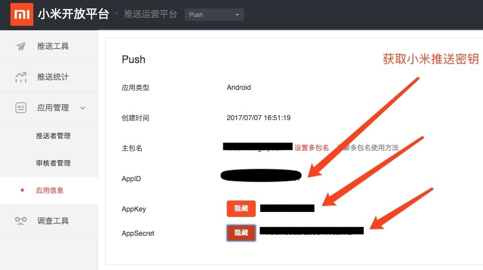
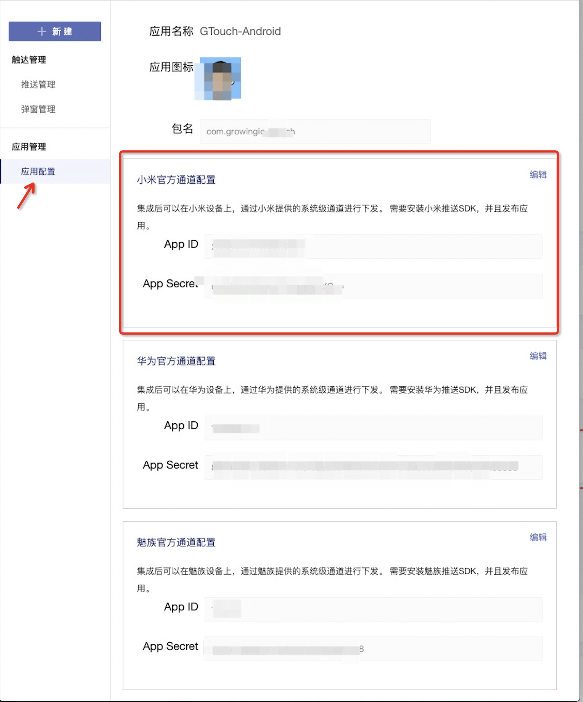

# 小米推送通道集成指南

### 1. 获取小米推送秘钥

根据[小米开放平台](https://dev.mi.com/console/appservice/push.html)指引开通小米开发者账号,然后注册应用并获取小米推送的秘钥。

认证小米开发者：


获取小米推送秘钥：



### 2. 在app build.gradle添加小米通道SDK依赖

```java
dependencies {
    ...
    //由于触达底层网络库依赖OkHttp3网络库，请添加OkHttp3依赖
    implementation 'com.squareup.okhttp3:okhttp:3.12.1'
    //触达SDK依赖
    implementation 'com.growingio.android:gtouch:$latestVersion'
    //小米推送SDK依赖
    implementation 'com.growingio.android.gpush:gpush-xiaomi-adapter:$latestVersion'
}
```

> $latestVersion 为最新SDK版本号，现最新的版本号为请参考[SDK更新日志](../integrations/changelog.md)。

### 3. 配置AppID和AppKey

```java
android {
        ......
        defaultConfig {
            manifestPlaceholders = [
                PACKAGE_NAME        : "您的APP包名",

                GPUSH_XIAOMI_APP_ID : "小米推送的AppId",
                GPUSH_XIAOMI_APP_KEY: "小米推送的AppKey",
            ]
            ......
        }
        ......
}
```

### 4. 代码混淆

```java
-keep class com.xiaomi.**{*;}

-keep public class * extends com.xiaomi.mipush.sdk.PushMessageReceiver
```

### 5. 配置服务端AppID和AppSecret



在应用配置界面输入您APP的AppID和AppSecret

### 6. 厂商通道测试方法

1. 将集成好的App（测试版本）安装在一台小米测试机上，并且运行App
2. 保持App在前台运行，尝试扫码测试推送消息
3. 如果应用收到消息，将App退到后台，并且杀掉所有App进程
4. 再次进行测试推送消息，如果能够收到推送，则表明厂商通道集成成功

### 7. 兼容性

如果您的App已经集成了个推VIP或极光VIP版本的推送SDK，我们的Android SDK也能兼容。

为了和个推兼容，我们将厂商通道独立打包。以小米推送通道为例，我们打包两个SDK：gpush-mipush-sdk和gpush-xiaomi-adapter。如果是从未接过个推、极光等VIP版本的用户可以直接添加触达华为推送通道依赖。

```java
implementation 'com.growingio.android.gpush:gpush-xiaomi-adapter:$latestVersion'
```

如果是个推、极光等VIP版本的用户可以将华为官方SDK包gpush-hms-agent 排除出去。

```java
implementation ('com.growingio.android.gpush:gpush-xiaomi-adapter:$latestVersion'){
      exclude(group: 'com.growingio.android.gpush' , module: 'gpush-mipush-sdk')
}
```

