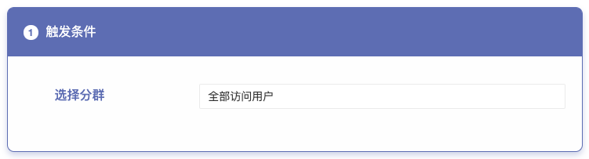

# 资源位

## 概述

几乎所有App都有 Banner 资源位，Banner 位可以同时放置多张图片素材，采用轮播的方式，每隔几秒钟，系统会自动切换下一张，循环播放（也称为轮播图），也可以只放一张图片作为促销/广告等活动的入口。

Banner位的运营是至关重要的，使用 GIO 运营平台提供的 App 内资源位组件，**不仅能够帮助运营方便的根据活动上下线不同的资源位素材，调整顺序，提前设置上线下线时间，方便及时的追踪每个资源位的数据（曝光，点击，转化），还能让您根据当前用户的偏好、属性设置个性化的展示规则，通过简单的操作做到「千人千面」的精细化运营。**

## 1. 新建资源位

在侧边栏中点击资源位，进入资源位列表页，可以点击新建资源位按钮，添加一个资源位

选择新建一个轮播banner资源位，并添加一个容易辨认的名称，比如「首页轮播位」。需要说明的是，这里的一个资源位指的是一个固定的运营位置，在该位置下可以添加多张素材，新建成功后该位置会分配到一个固定的 Key

如下列表所示，将这个Key给到开发人员，写在代码相应位置，就可以做好关联。

如果您想要在多个二级页面使用同样的轮播位，只要都关联到同一个Key就可以实现。比如「希望所有商品详情页下方都有一个相同规则的轮播位」。

## 2. 设置资源位素材

点击新建的资源位，进入该资源位的编辑页面

根据运营需求添加该轮播位素材，填写相应的分群，素材和跳转地址，目前最多支持上传10个位置的素材。

设置成功后，可以点击保存上线，该资源位就可以在线上展示了。

## 3. 设置个性化展示策略

很多情况下，我们并不希望针对所有用户展示完全相同的Banner ，GIO支持非常灵活的个性化展示策略。

### 场景1: 在某个Banner位上设置个性化展示

> 某航空公司App ，运营希望所有人都看到5张轮播图，但近期有一些航线在做活动，希望 搜索过「泰国」「新加坡」航线的用户在第一位能看到 东南亚国家机票打折的活动。

操作方法：

鼠标hover在第一张banner的位置，会出现个性展示的按钮，点击在该位置上添加素材

人群选择设置相应的规则：

上传对应素材后完成，可以在列表页看到，

在某个位置上可以设置多张个性化展示规则，最多10个，优先级越靠上的越高。

### 场景2：不同的用户看到不同个数的banner

> 针对新用户的运营策略：运营希望提升新用户的留存，老用户看到 5张常规banner，但新注册完成的用户看到7张，在 第一位 和 第二位 看到新用户红包和新人奖励。

操作方法：

只需要在第一位和第二位添加 用户分群 为 新用户（根据您实际的用户属性选择）的Banner，优先级也是从高到底判断，假设一共有7张banner，前两张的分群选择为新用户，那么对于满足新用户条件的用户看到的顺序依次是 1，2，3，4，5，6，7，对于普通用户看到的依次是 3，4，5，6，7 共5张banner

## 4. 查看数据

banner上线后，在列表页就可以看到每张banner的展示人数，点击人数和点击率。如果想看更详细的数据，可以点击列表上放的在事件分析中查看数据 。

