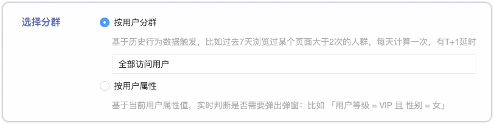
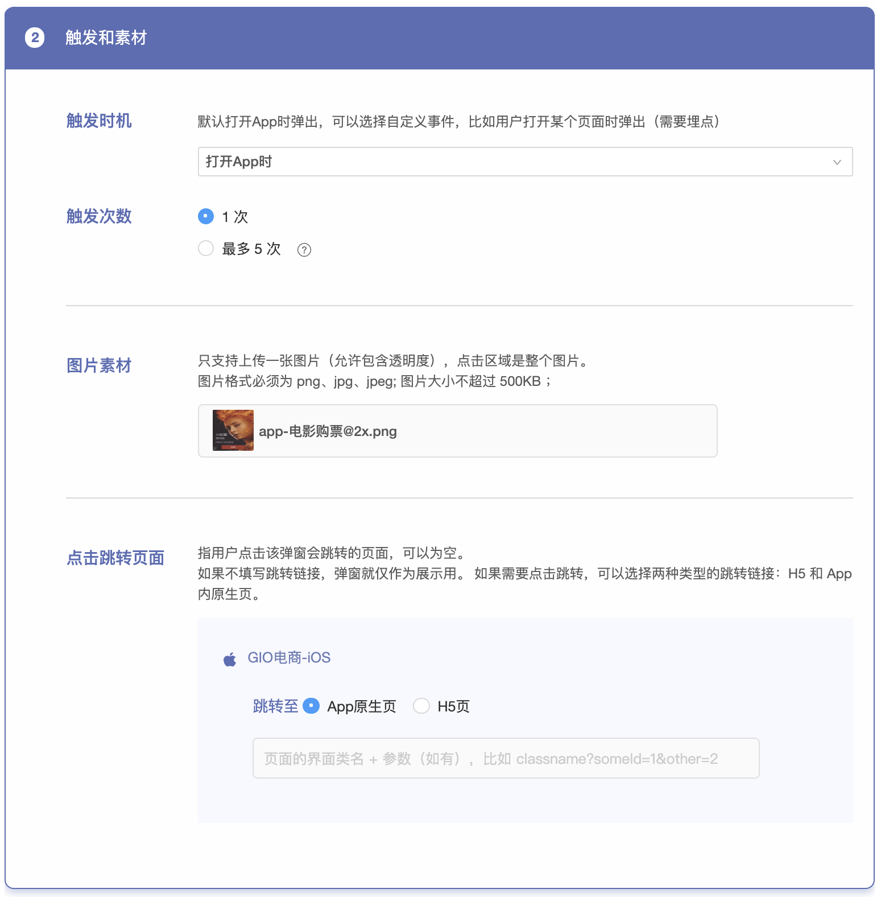

# 移动应用弹窗

## 新建弹窗

### 第一步：选择分群

选择发送给谁可以有两种方式：

* **用户分群**

直接选择之前创建过的分群，这种方式会有T+1的延时，每天凌晨会按照条件跑一遍分群数据，用户次日访问App时会判断该用户是否在某个分群中，满足条件弹出。

但如果选择四种预定义分群：全部登录用户，全部访问用户，新登录用户，新访问用户，在触达中是实时判断的。比如选择新登录用户，那么每个打开App的用户，触达 SDK 都会实时判断该用户是否为新登陆的用户。

* **用户属性**

这种方式可以实时的判断用户在访问App时是否命中条件。（要求弹窗 SDK 版本为 0.3.0 以上，在触发自定义事件之前，确保已经调用过该接口上传登录用户变量）

如何上传用户属性见：

Android：[自定义数据上传](https://docs.growingio.com/docs/developer-manual/sdkintegrated/android-sdk/android-sdk-api/customize-api)

iOS：[自定义数据上传](https://docs.growingio.com/docs/developer-manual/sdkintegrated/ios-sdk/ios-sdk-api/customize-api)

### **第二步：**触发条件和上传素材

**触发时机：**

就是用户会在什么时间看到这个弹窗？

默认触发时机为「**打开App时**」，也可以选择任意 **自定义打点事件**（Android、iOS），比如在用户「进入某功能页面后」、「完成购买行为后」「登录后」等。


如果运营人员选择了 「**打开App时**」 弹出。 需要注意：如果您的 App 包含闪屏页面，那么代码层面需要做特殊处理。因为 SDK 并不能判断闪屏什么时候结束。 为了避免在闪屏页面出现弹窗，有两种处理方法：

处理方法1：

* 在需要弹出的页面埋点，运营人员在下拉框中选择相应的埋点事件作为触发时机。这种方法可以精准的控制弹出时机。

处理方法2：

* 在 App onCreate 的时候设置关闭弹窗。使用 GrowingTouch.startWithConfig\(this, new GTouchConfig\(\) .setEventPopupEnable\(false\) 
* 然后再在首页MainActivity中调用 enableEventPopupAndGenerateAppOpenEvent 或者setEventPopupEnable\(true\)


埋点事件如何创建？详见下面的 PPT ：



**触发次数**：

弹窗的触发频率可以设置为只触发 1 次，或是多次。如果设置多次触发，需要定义触发次数上限，以及每次的间隔时间。

**弹窗素材**：

背景图片素材不超过 500 KB，如果有需要可以使用 [tinypng](https://tinypng.com/) 等在线网站进行压缩，或者让设计师直接做出这个大小的图片。

* 素材建议大小：

iPhone8 的屏幕宽度是375px。所以弹窗素材宽度在300px至330px左右，高度250px至600px左右，都是合适大小。GIO 弹窗不会拉伸用户上传的图片，会保证原始比例。为保证清晰度，请导出@2x或@3x的图片。

* 小Tips：

GIO 弹窗支持带有透明度的 PNG 格式图片，所以可以做任何形状，不一定要拘泥于矩形。

实践经验表明，弹窗做的越好看，愿意点击的用户越多哦！

**转跳页面：**

用户点击弹窗后，跳转到哪个页面呢？

* 可以是**App原生页面**，原生页面跳转链接是的格式为 `classname?key1=value1&key2=value2`，请与开发同学确认（前面不需要加协议名，GIO会默认加上自己的协议头）
* 可以是**H5页面**（加上 http:// 或 https:// 开头）
* 也支持**自定义协议**，任何您自己的协议头都可以（推荐这种方式，更灵活）
* 如果不填写跳转链接，则默认作为展示用，点击后关闭弹窗

### 第三步： 测试和上线

确保上面的两步完成后，就可以扫码测试看效果了。

选择需要测试的 App ，使用包含有 **安装了弹窗 SDK 的 App** 的设备进行扫码，唤醒 App ，进行测试，为了更方便的供测试者查看弹窗效果，不管扫码的设备是否在分群中，都会在相应的时机弹出弹窗。

**弹窗数据**

开始时间为该弹窗第一次「上线」的时间，不可变更。

可以切换「今天」和「过去」来查看数据，「过去」为弹窗开始时间到昨天的数据，以天为颗粒度展示；「今天」为今天的数据，以分钟为颗粒度展示。

可以选择已经定义的某个指标为**转化目标**，在「今天」的数据下，设置转化目标后，转化数据始终有 1 小时的延迟，转化数的意义是：「看到了弹窗，并完成转化目标」，如果想了解点击弹窗后完成目标的用户，可以看分步骤漏斗图。

**大数字图**

可以在大数字图中看到弹窗启动后的所有主要数据。具体的数据解释可以查看数据名词旁边的图标。大数据的更新为分钟级别。

**趋势图（线图）**

在趋势图中查看最近一段时间的数据变化。可以切换看 点击，展示和转化次数，如果想要做更深入的数据分析，比如添加维度下钻和拆分，可以点击该图标的右下角，进入到**事件分析**中做深度分析。

**漏斗**

可以在漏斗图中看到从「今日启动 App 的用户」-「展示 App 的用户」- 「点击 App 的用户」-「转化目标」（如有），点击每一步的柱子，可以将这部分人下钻到分群，在 GIO 其他分析工具中进行进一步分析。

## 

