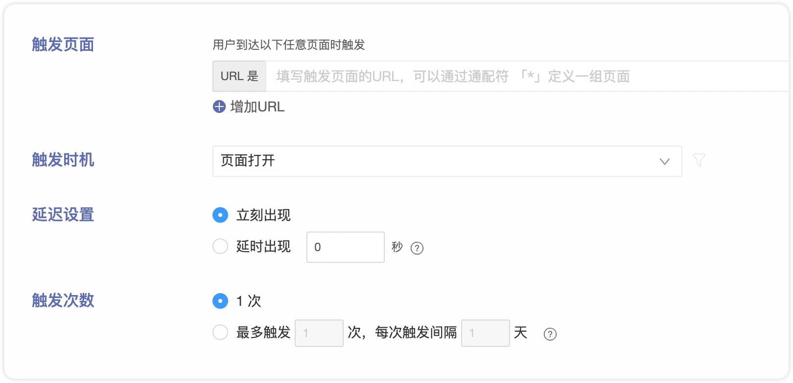
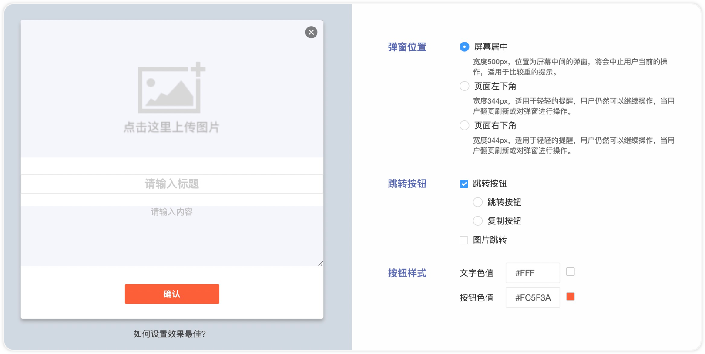
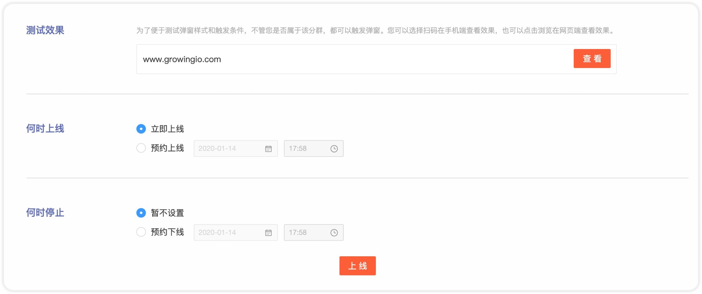
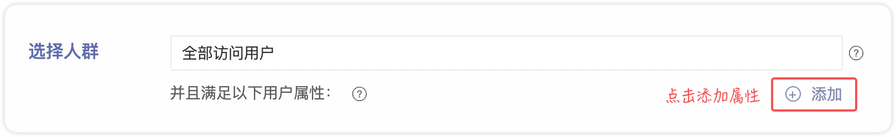
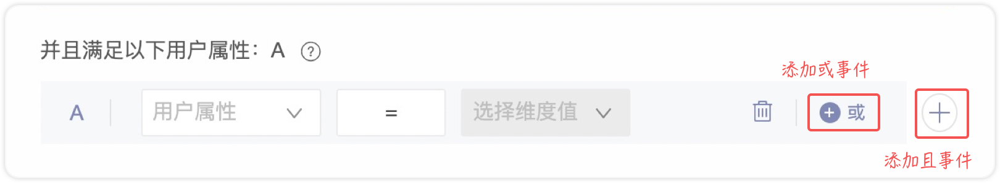
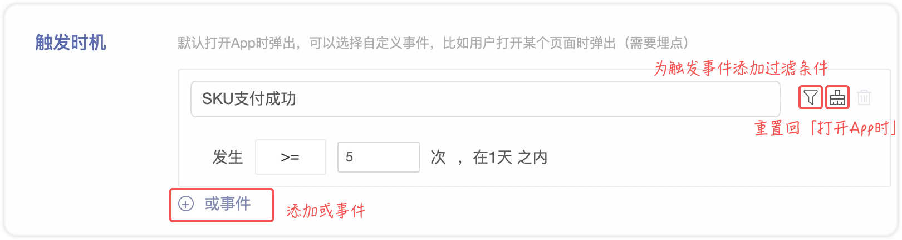
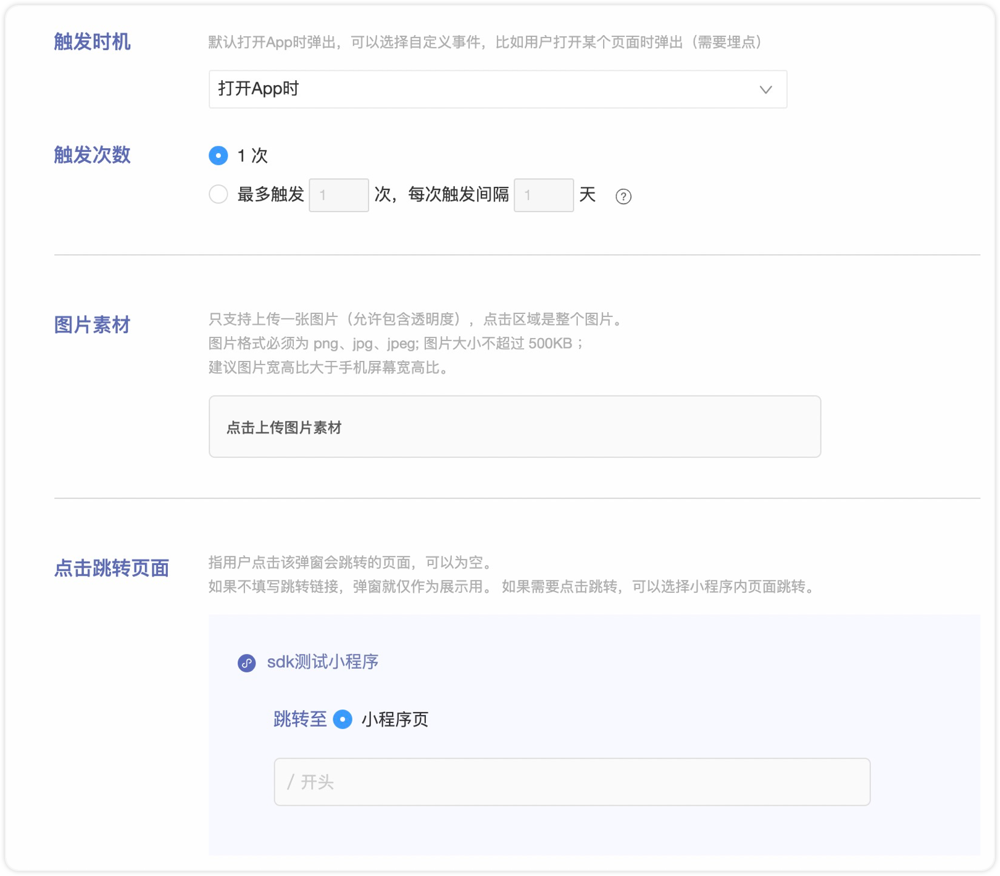
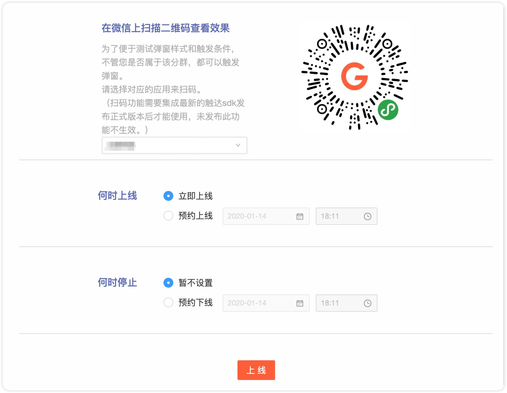
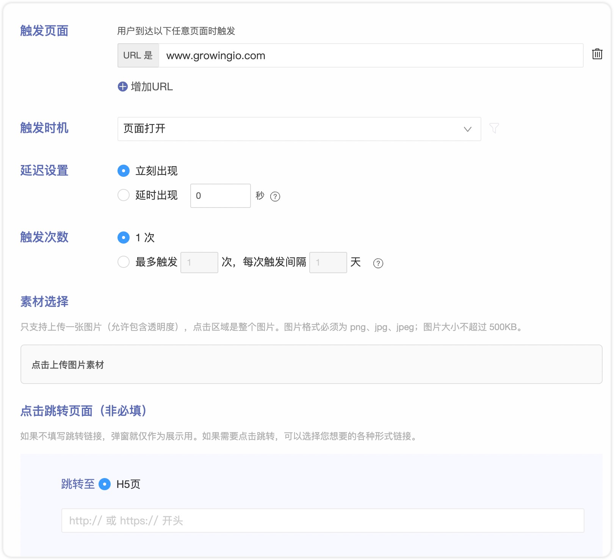
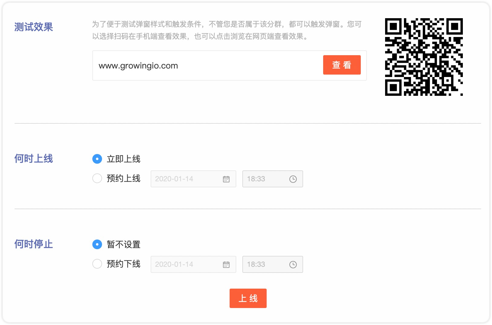

# 创建弹窗

进入**用户运营**模块，在顶部导航栏选择**运营**。

当前支持配置以下应用的弹窗：



### 新建弹窗

&#x20;单击界面左上角的**新建**，选择**弹窗**，再选择**网站**。

### 用户选择

.png>)

选择要发送弹窗的目标用户。可使用创建好的用户分群。


**用户分群**

* 直接选择之前创建过的分群（创建好的用户分群每天凌晨会按照条件跑一遍分群数据），这种方式会有T+1的延时）用户次日访问App时会判断该用户是否在某个分群中，满足条件弹出。
* 但如果选择四种预定义分群：全部登录用户，全部访问用户，新登录用户，新访问用户，在弹窗SDK中是实时判断的。比如选择新登录用户，那么每个打开App的用户，弹窗 SDK 都会实时判断该用户是否为新登陆的用户。


### 触发设置

| 参数   | 说明                                                                                                                                                                                                                                                                                                                                                                                                                                                                                                                                                                                                                                                                                             |
| ---- | ---------------------------------------------------------------------------------------------------------------------------------------------------------------------------------------------------------------------------------------------------------------------------------------------------------------------------------------------------------------------------------------------------------------------------------------------------------------------------------------------------------------------------------------------------------------------------------------------------------------------------------------------------------------------------------------------- |
| 触发页面 | 
是指，当用户到达哪个/些页面的时候，弹出弹窗。添加多个条件时，意味着用户只要到达其中任意一个页面，都会弹出弹窗。

比如，
<ul><li>支持<strong>特定页面</strong>：你想在用户到达 www.growingio.com 页面时发送弹窗，就可以将这个页面 www.growingio.com 输入进去。</li><li>支持<strong>页面组通配符</strong>：如果你想在用户到达 www.growingio.com 域名下所有页面时发送弹窗，可以输入 www.growingio.com*。暂不支持 *.growingio.com与的形式。</li><li>支持<strong>url参数通配符</strong>：比如www.growingio.com?key1=a&#x26;key2=*匹配所有参数带key1=a与key2的情况。或www.growingio.com?key1=*匹配所有参数带key1的情况。</li><li>暂不支持 *.growingio.com，www.growingio.com?key=a*与www.growingio.com?*的写法。</li><li>支持<strong>多个页面组合</strong>：你想在用户到达 www.growingio.com/1 和 www.growingio.com/2 时触发，可以通过<strong>增加URL</strong>按钮输入两个URL。</li><li>暂不支持匹配#后面的hash值</li></ul> |
| 触发时机 | 

就是用户会在什么时间看到这个弹窗？

默认触发时机为「<strong>页面打开</strong>」时，也可以选择其他事件作为触发时机。
                                                                                                                                                                                                                                                                                                                                                                                                                                                                                                                                                                                                         |
| 延迟设置 | 设置弹窗在满足触发条件后的延迟弹出时间。                                                                                                                                                                                                                                                                                                                                                                                                                                                                                                                                                                                                                                                                           |
| 触发次数 | 
弹窗的触发频率可以设置为只触发 1 次，或是多次。

如果设置多次触发，需要定义触发次数上限，以及每次的间隔时间。

只要用户没有点击查看弹窗或者关闭弹窗，且触发次数没有达到上限就会再次触发。
                                                                                                                                                                                                                                                                                                                                                                                                                                                                                                                                                                              |

埋点事件如何创建请参见：数据定义 > [埋点事件及事件级变量](https://docs.growingio.com/v3/introduction/data-definition/ustom-event/event)。

### 弹窗样式

| 参数   | 说明                                                                                                                       |
| ---- | ------------------------------------------------------------------------------------------------------------------------ |
| 图片上传 | 上传您要在Web页面弹窗展示的图片，大小不得超过500KB。上传您可以在图片上传区域选填标题和部分文本内容及修改按钮文本。上传的图片会根据弹窗位置进行高度自适应。                                        |
| 弹窗位置 | 
屏幕居中：宽度500px，位置为屏幕中间的弹窗，将会中止用户当前的操作，适用于比较重的提示。

屏幕左小角/屏幕右下角：宽度344px，适用于轻轻的提醒，用户仍然可以继续操作，当用户翻页刷新或对弹窗进行操作。
     |
| 转跳配置 | 
转跳按钮：
<ul><li>转跳按钮：设置转跳链接，用户单击按钮时会进行转跳。</li><li>复制按钮：设置文本内容，用户单击按钮时会复制文档。</li></ul>
图片转跳：设置转跳链接，用户单击图片时进行转跳。
 |

### 测试和上线

配置完以上步骤后，单击保存即可进行测试和上线。

| 参数     | 说明                          |
| ------ | --------------------------- |
| 测试效果   | 单击测试效果右侧的查看，会转跳到弹窗页面展示弹窗效果。 |
| 上线时间配置 | 

您可以配置弹窗上下线时间。
 |




本页内容不包含添加分群/控制组对比、添加素材对比、添加活动对比的配置，相关配置请参考[A/B测试](ab-experiment.md)。


### 新建弹窗

单击界面左上角的**新建**，选择**弹窗**，再选择**移动应用**。

### 用户选择

选择要发送弹窗的目标用户。可使用创建好的**用户分群**来筛选用户。您可以在分群的基础上添加用户属性，属性为 SDK 实时判断。


**用户分群**

* 直接选择之前创建过的分群（创建好的用户分群每天凌晨会按照条件跑一遍分群数据，这种方式会有T+1的延时）用户次日访问App时会判断该用户是否在某个分群中，满足条件弹出。
* 但如果选择四种预定义分群：全部登录用户，全部访问用户，新登录用户，新访问用户，在弹窗 SDK 中是实时判断的。比如选择新登录用户，那么每个打开App的用户，弹窗 SDK 都会实时判断该用户是否为新登录的用户。


并且属性条件支持且、或等复杂的逻辑连接。

### **产品选择**

您可以最多选择一个 Android 端和一个 iOS 端 App。

### 触发&素材

* **触发时机**

就是用户会在什么时间看到这个弹窗？默认触发时机为「**打开App时**」，也可以选择其他事件作为触发时机。

并且，我们能够实现精准的控制某个事件发生第 N 次后再触发弹窗。如：支付成功 5 次以上、收藏商品超过 3 次等。


如果运营人员选择了 「**打开App时**」 弹出。 需要注意：如果您的 App 包含闪屏页面，那么代码层面需要做特殊处理。因为 SDK 并不能判断闪屏什么时候结束。 为了避免在闪屏页面出现弹窗，有两种处理方法：

处理方法1：

* 在需要弹出的页面埋点，运营人员在下拉框中选择相应的埋点事件作为触发时机。这种方法可以精准的控制弹出时机。

处理方法2：

* 在 App onCreate 的时候设置关闭弹窗。使用 GrowingTouch.startWithConfig(this, new GTouchConfig() .setEventPopupEnable(false)&#x20;
* 然后再在首页MainActivity中调用 enableEventPopupAndGenerateAppOpenEvent 或者setEventPopupEnable(true)


埋点事件如何创建请参见：数据定义 > [埋点事件及事件级变量](https://docs.growingio.com/v3/introduction/data-definition/ustom-event/event)。

* **触发次数**

弹窗的触发频率可以设置为只触发 1 次，或是多次。

如果设置多次触发，需要定义触发次数上限，以及每次的间隔时间。


**触发说明**

只要用户没有点击查看弹窗或者关闭弹窗，且触发次数没有达到上限就会再次触发。


* **图片素材**

上传不超过500KB大小的背景图片素材，如果有需要可以使用 [tinypng](https://tinypng.com) 等在线网站进行压缩，或者让设计师直接做出这个大小的图片。


素材建议大小：

iPhone8 的屏幕宽度是375px。所以弹窗素材宽度在300px至330px左右，高度250px至600px左右，都是合适大小。GIO 弹窗不会拉伸用户上传的图片，会保证原始比例。为保证清晰度，请导出@2x或@3x的图片。


GIO 弹窗支持带有透明度的 PNG 格式图片，所以可以做任何形状，不一定要拘泥于矩形。

实践经验表明，弹窗做的越好看，愿意点击的用户越多哦！

* **转跳页面**

用户点击弹窗后，跳转到哪个页面呢？

| 类型      | 说明                                                                                                                 |
| ------- | ------------------------------------------------------------------------------------------------------------------ |
| App原生页  | 

原生页面跳转链接是的格式为 <code>classname?key1=value1&#x26;key2=value2</code>，请与开发同学确认（前面不需要加协议名，GIO会默认加上自己的协议头）
 |
| H5页面    | 加上 http:// 或 https:// 开头                                                                                           |
| 自定义协议   | 任何您自己的协议头都可以（推荐这种方式，更灵活）                                                                                           |
| 推送权限设置页 | 弹窗支持跳转到系统设置页, 使用上选择访问用户分群，属性推送设置关，即可默认选择推送权限设置页，（SDK需要同时集成弹窗和推送）                                                   |
| 不填写     | 则默认作为展示用，点击后关闭弹窗                                                                                                   |

**推送权限设置页面**（SDK需要同时集成弹窗和推送）

如果想让您的用户打开手机的推送权限设置页面，您可以选择上线一条「推送权限设置页」弹窗，注意需要先在分群里选择访问用户属性：「推送权限设置」=「关」。

### 测试和上线

.png>)

配置完上述步骤后，单击保存即可进行测试和上线。

**扫码测试**：选择需要测试的 App ，使用包含有 **安装了弹窗 SDK 的 App** 的设备进行扫码唤醒 App ，进行测试。为了更方便的供测试者查看弹窗效果，不管扫码的设备是否在分群中，都会在相应的时机弹出弹窗。

**上线时间配置：**您可以配置弹窗上下线时间。



### 新建弹窗

单击界面左上角的**新建**，选择**弹窗**，再选择**小程序**。

### 用户&产品选择

选择要发送弹窗的目标用户。可使用创建好的用户分群。

* **用户分群**

直接选择之前创建过的分群（创建好的用户分群每天凌晨会按照条件跑一遍分群数据），这种方式会有T+1的延 时）用户次日访问App时会判断该用户是否在某个分群中，满足条件弹出。

但如果选择四种预定义分群：全部登录用户，全部访问用户，新登录用户，新访问用户，在触达中是实时判断的。比如选择新登录用户，那么每个打开App的用户，触达 SDK 都会实时判断该用户是否为新登陆的用户。

* **产品选择**

您可以最多选择一个 微信小程序。

### 触发和素材

* **触发时机**

就是用户会在什么时间看到这个弹窗？

默认触发时机为「**打开App时**」(小程序每个页面的访问，都算一次打开APP)，也可以选择其他事件作为触发时机。

埋点事件如何创建请参见：数据定义 > [埋点事件及事件级变量](https://docs.growingio.com/v3/introduction/data-definition/ustom-event/event)。

* **触发次数**

弹窗的触发频率可以设置为只触发 1 次，或是多次。

如果设置多次触发，需要定义触发次数上限，以及每次的间隔时间。


**触发说明**

只要用户没有点击查看弹窗或者关闭弹窗，且触发次数没有达到上限就会再次触发。


* **图片素材**

上传不超过500KB大小的背景图片素材（允许包含透明度）


图片处理建议

如果有需要可以使用 [tinypng](https://tinypng.com) 等在线网站进行压缩，或者让设计师直接做出这个大小的图片。


* **点击转跳页面**

设置点击该弹窗会转跳的页面，可以为空。

### 测试和上线

配置以上步骤后，单击保存即可进行测试和上线。

**扫码测试**：选择需要测试的 App ，使用包含有 **安装了弹窗 SDK 的 App** 的设备进行扫码唤醒 App ，进行测试。为了更方便的供测试者查看弹窗效果，不管扫码的设备是否在分群中，都会在相应的时机弹出弹窗。

**设备ID预览**:  支持访问用户ID和登陆用户ID预览弹窗，忽略分群，触发事件就可以弹窗

**上线时间配置：**您可以配置弹窗上下线时间。



### 新建弹窗

单击界面左上角的**新建**，选择**弹窗**，再选择**H5应用**。

### 用户选择

选择要发送弹窗的目标用户。可使用创建好的用户分群。

* **用户分群**

直接选择之前创建过的分群（创建好的用户分群每天凌晨会按照条件跑一遍分群数据），这种方式会有T+1的延 时）用户次日访问App时会判断该用户是否在某个分群中，满足条件弹出。

但如果选择四种预定义分群：全部登录用户，全部访问用户，新登录用户，新访问用户，在触达中是实时判断的。比如选择新登录用户，那么每个打开App的用户，触达 SDK 都会实时判断该用户是否为新登陆的用户。

### 触发&素材

| 参数     | 说明                                                                                                                                                                                                                                                                                                                                                                                                                     |
| ------ | ---------------------------------------------------------------------------------------------------------------------------------------------------------------------------------------------------------------------------------------------------------------------------------------------------------------------------------------------------------------------------------------------------------------------- |
| 触发页面   | 
是指，当用户到达哪个/些页面的时候，弹出弹窗。添加多个条件时，意味着用户只要到达其中任意一个页面，都会弹出弹窗。

比如，
<ul><li>支持<strong>特定页面</strong>：你想在用户到达 www.growingio.com 页面时发送弹窗，就可以将这个页面 www.growingio.com 输入进去。</li><li>支持<strong>页面组通配符</strong>：如果你想在用户到达 www.growingio.com 域名下所有页面时发送弹窗，可以输入 www.growingio.com*。</li><li>支持<strong>多个页面组合</strong>：你想在用户到达 www.growingio.com/1 和 www.growingio.com/2 时触发，可以通过<strong>增加URL</strong>按钮输入两个URL。</li></ul> |
| 触发时机   | 

就是用户会在什么时间看到这个弹窗？

默认触发时机为「<strong>页面打开</strong>」时，也可以选择其他事件作为触发时机。
                                                                                                                                                                                                                                                                                                                                 |
| 延迟设置   | 设置弹窗在满足触发条件后的延迟弹出时间。                                                                                                                                                                                                                                                                                                                                                                                                   |
| 触发次数   | 
弹窗的触发频率可以设置为只触发 1 次，或是多次。

如果设置多次触发，需要定义触发次数上限，以及每次的间隔时间。

只要用户没有点击查看弹窗或者关闭弹窗，且触发次数没有达到上限就会再次触发。
                                                                                                                                                                                                                                                                                                      |
| 素材选择   | 

上传不超过500KB大小的背景图片素材（允许包含透明度）。

如果有需要可以使用 <a href="https://tinypng.com">tinypng</a> 等在线网站进行压缩，或者让设计师直接做出这个大小的图片。
                                                                                                                                                                                                                                                                                     |
| 点击转跳页面 | 

设置点击该弹窗会转跳的页面，可以为空。
                                                                                                                                                                                                                                                                                                                                                                                      |

### 测试和上线

配置完以上步骤后，单击保存即可进行测试和上线。

**扫码测试**：选择需要测试的 App ，使用包含有 **安装了弹窗 SDK 的 App** 的设备进行扫码唤醒 App ，进行测试。为了更方便的供测试者查看弹窗效果，不管扫码的设备是否在分群中，都会在相应的时机弹出弹窗。

**上线时间配置：**您可以配置弹窗上下线时间。



##
