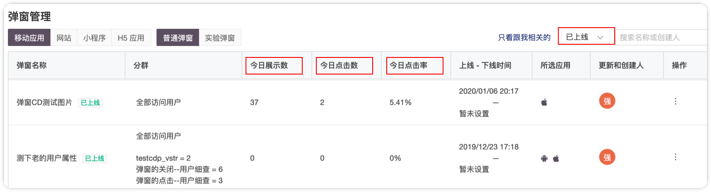
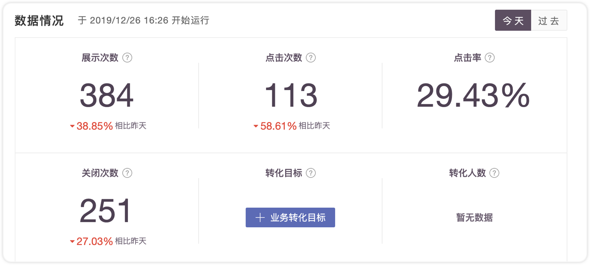
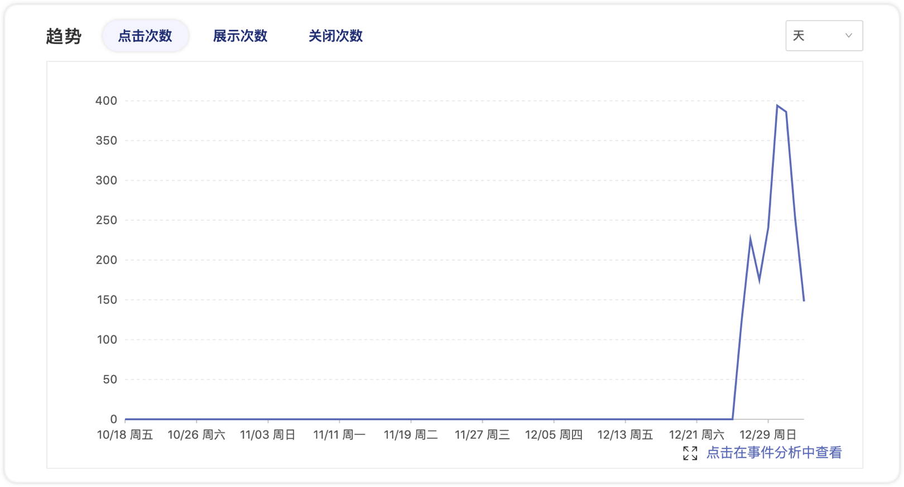
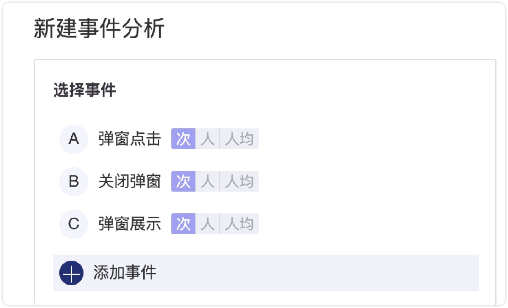
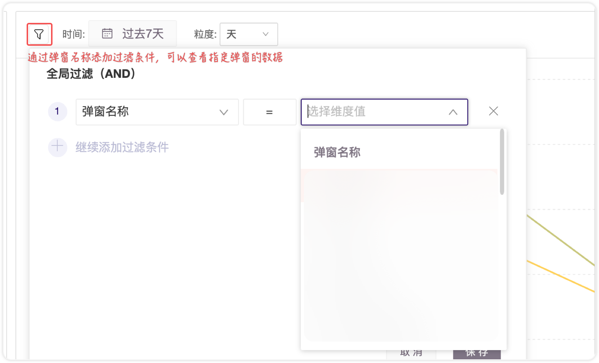

# 弹窗数据

弹窗编辑上线后，可以在列表中看到基本数据，也可以点击列表中的弹窗名称，进入到数据报告页，查看到详细数据。

## 1.列表数据

在列表页面，对于已上线的弹窗可以看到今日的展示、点击和点击率数据；对于已下线的弹窗，可以看到该弹窗在上线期间的全部展示、点击和点击率数据。

在列表中点击弹窗名称可以进入到详细的数据报告页面。

## 2.数据详情

弹窗的数据报表页包含四个部分：规则、大数字、趋势图、漏斗图

### **规则**

已上线的弹窗在数据详情页面可以看到该弹窗的规则（如下图）。

如果上线后发现需要修改规则，可以点击右上角的按钮：编辑消息规则。修改规则之前需要先暂停，修改完成后可以再次上线，上线后，之前已经收到过该弹窗的用户不会再次收到。

### **大数字**

数据接口为数据端提供的实时接口，每5分钟刷新一次数据

### **趋势图**

点击右下角，可以在事件分析中查看该弹窗的数据。事件分析中支持更灵活的数据分析方式，比如维度拆解，时间范围修改等。

### **漏斗图**

## 3.弹窗数据在数据分析功能模块中的应用

GrowingIO运营平台为弹窗预置了三个埋点事件和一个事件变量。

3个预定义事件为：「弹窗展示」、「弹窗点击」、「弹窗关闭」及一个预定义变量「弹窗名称」

在事件分析、漏斗、留存、分群等分析工具中都可以灵活使用。如下图：

