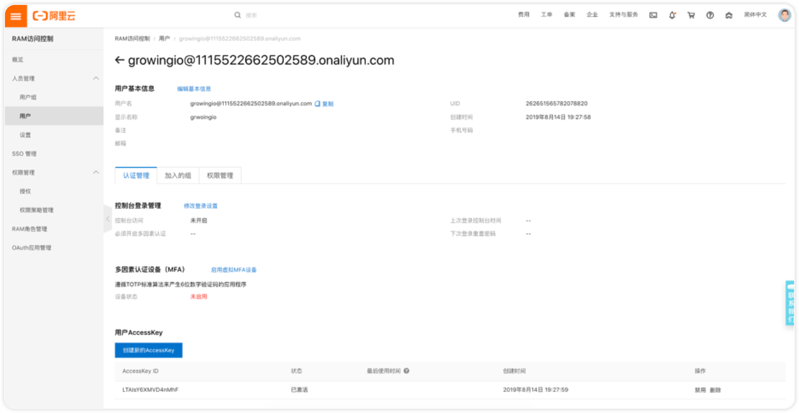

# Web弹窗

新建弹窗

为了达到我们的运营目标，我们会通过 3 个步骤，来确定「给哪些用户发送弹窗」，「在什么时机发」，「发送什么内容的弹窗」。

### **第一步：选择分群**

可以选择想要发送弹窗的用户群里，我们为你提供了四个默认的分群：「全部登录用户」、「全部访问用户」、「新登录用户」、「新访问用户」，你也可以选择自定义分群，或者新创建一个。

### **第二步：**触发条件

**触发页面**

是指，当用户到达哪个/些页面的时候，弹出弹窗。添加多个条件时，意味着用户只要到达其中任意一个页面，都会弹出弹窗。

比如，

* 1.支持**特定页面**：你想在用户到达 www.growingio.com 页面时发送弹窗，就可以将这个页面 www.growingio.com 输入进去；
* 2.支持**页面组通配符**：如果你想在用户到达 www.growingio.com 域名下所有页面时发送弹窗，可以输入 www.growingio.com\*
* 3.支持**多个页面组合**：你想在用户到达 [www.growingio.com/1](http://www.growingio.com/1) 和 [www.growingio.com/2](http://www.growingio.com/1) 时触发，可以输入两个URL：

**延迟设置**

是指，当你想要让用户在页面中浏览一会儿再弹出弹窗时，就可以用这个功能了，输入你想延迟的时间，用户停留到达这个时间时，才会弹出。

**触发次数**

是指，你可以决定弹窗「只展示一次」还是「展示最多5次直到用户点击了弹窗」。当你想要发一个很重要的提示消息，不希望用户错过时，可以选择后者，不过即使选择了后者，在30分钟之内即使用户再次触发弹出规则，也不会弹出弹窗，是为了不让用户过于频繁地被打扰。

### **第三步：弹窗样式**

我们提供了两种弹窗的模式，分别是在「**浏览器中间显示，点击X掉或按钮才会消失**」和在「**左下角展示，被点击或10S无点击自动消失**」，根据信息的重要强度，你可以选择不同的形式，左下角的展示比较适合于「**轻轻的提示**」，信息有展示，却并**不很打扰用户**，不打断他们的正常操作。另外，不管是哪种样式的弹窗，**在用户跳转或刷新页面时，都会消失。**

你可以在这里设置弹窗的样式，我们提供了较为灵活的样式示例，你可以设置以下几种组合：

1. 弹窗由图片 + 标题/内容组成，适合于要传达的内容比较少的场景。

2. 弹窗由标题 + 内容组成，适合于简单的通知。

3. 弹窗由图片 + 标题 + 文字组成，这是一个媒体形式比较完整的弹窗，所需的素材也比较多。

### 第四步：测试和上线

在测试效果中输入想要查看弹窗效果的网页URL（必须是在弹出页面范围内的），就可以立刻查看效果。

如果测试没问题，可以选择立刻上线，也可以预约未来的某个时间上线。或者预约某个时间自动下线。

#### 弹窗数据

弹窗提供了基本的数据供你监控和分析，包括但是不限于弹窗的展示、点击、关闭等基本数据和趋势图，数据以分钟级别实时更新。

弹窗上线后，可以立刻看到展示数据。

开始时间为该弹窗第一次「上线」的时间，不可变更。

可以切换「今天」和「过去」来查看数据，「过去」为弹窗开始时间到昨天的数据，以天为颗粒度展示；「今天」为今天的数据，以分钟为颗粒度展示。

可以选择已经定义的某个指标为**转化目标**，在「今天」的数据下，设置转化目标后，转化数据始终有 1 小时的延迟，转化数的意义是：「看到了弹窗，并完成转化目标」，如果想了解点击弹窗后完成目标的用户，可以看分步骤漏斗图。

#### **大数字图**

可以在大数字图中看到弹窗启动后的所有主要数据。具体的数据解释可以查看数据名词旁边的图标。大数据的更新为分钟级别。

#### **趋势图（线图）**

在趋势图中查看最近一段时间的数据变化。可以切换看 点击，展示和转化次数，如果想要做更深入的数据分析，比如添加维度下钻和拆分，可以点击该图标的右下角，进入到**事件分析**中做深度分析。

#### **漏斗**

可以在漏斗图中看到从「展示弹窗的用户」- 「点击弹窗的用户」-「转化目标」（如有），点击每一步的柱子，可以将这部分人下钻到分群，在 GIO 其他分析工具中进行进一步分析。

