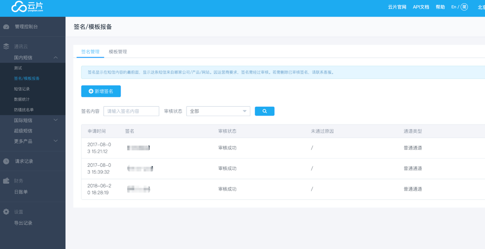
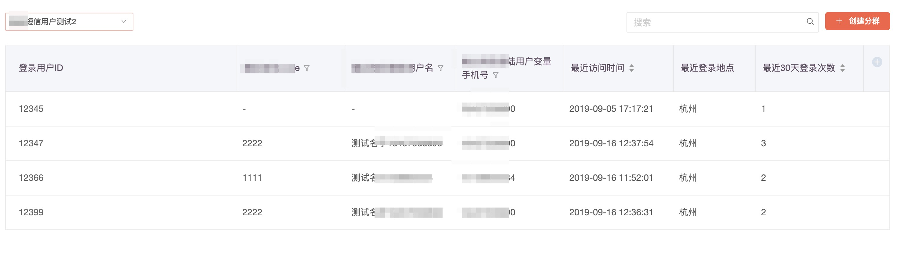

# 云片短信

在用户运营界面，您可以通过选择分群向用户发送短信，在使用第三方短信平台【云片）】之前，您需要完成以下工作：

### 1、配置云片账号

前往官网[https://www.yunpian.com/](https://www.yunpian.com/)，登录/注册

点击**APIKEY**右侧的眼睛获取完整内容**,**稍后需要在GIO平台填写**APIKEY**

点击**国内短信-&gt;签名/模板报备**,进行短信签名和模板的申请

### 2、在GIO触达平台配置

在「触达→短信配置」中，先选择保存有手机号的用户属性名称。

然后找到「云片」，填入上一步中得到的 **短信签名 , APIKEY** 参数并完成开通。

配置完成后，在新建活动时，可以选择短信消息通道给用户发信息，填写**模板id、短信内容变量**后， 满足条件的用户就会收到一条短信。


注意：

短信内容变量 并非真正的消息内容，指的是 在相对固定的模板内容中，有一些变量是可以根据实际情况作出调整的。

_实例模板：【GrowingIO】你好{name}，恭喜你获得100元VIP优惠券，请于3天内在App使用。_

其中{name}就是一个内容变量，在GIO系统中 可以点击内容变量框选择一个用户属性默认填入该变量中，变量会根据用户的变化而自动展示对应信息。

达成真实短信效果：_【GrowingIO】_你好王小明，恭喜你获得_100元VIP优惠券_，请于3天内在App使用。


### 3、运营人员使用GIO发送短信流程

1.选择分群和厂商（目前支持阿里云,云片,创蓝，根据客户的实际需求可以对接客户正在使用的短信SSP，方便直接用户Gio给相应分群发送精细化运营短信）

2.选择短信签名，填写模版id

获取状态码，判断是否可用

### 其他

1.想查看对应分群里面手机号的显示。可以去用户分析-用户细查 里面查看

### **4**、**发送短信后，未收到查看原因**

\*\*\*\*[1.查看云片短信发送状态](https://www.yunpian.com/console/#/domestic/record/send)

