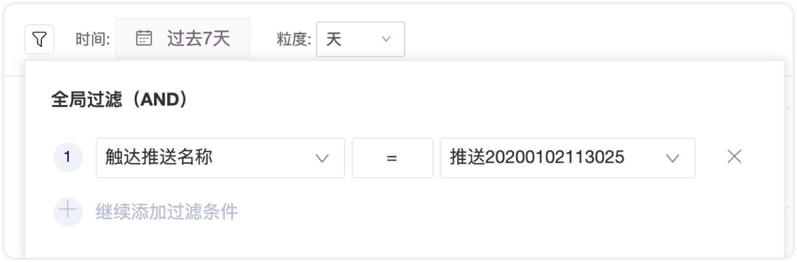

# 推送数据

Push发送完成后，可以实时看到数据效果。

在推送管理列表中可以看到基础数据，如果想要看更详细的数据以及做更多深入的分析，可以去数据报表页面。

## 推送数据报表页面

上线了的推送在列表中点击标题就能进入数据详情页面，下面是数据页提供的数据口径解释：

* **目标推送设备数**：符合推送条件的所有用户数，跟所选分群相关。
* **服务器送达**：指的是发送推送请求到第三方服务器。该数据由 GIO 埋点获取。
* **有效设备**：指的是厂商通过回调接口返回给 GIO 的设备送达数据。**关机、无网络、卸载App**以及关闭卸载权限的设备是无法送达的。厂商每秒会发送一次回调数据。
* **消息点击**：指的是 GIO 的 SDK 采集到用户点击消息事件。该数据由 GIO 打点获取。

运营者在发 Push 的时候非常关注的问题就是到达率的问题，下面详细解释在发Push的过程中每一步会发生什么，是哪些因素最终影响了实际到达用户设备的数量。

## 使用分析工具

推送功能为您预置了三个埋点指标及一个维度，您可以在分析工具中使用以获取更详细的数据趋势。比如下图直接在事件分析中就能选到

预置指标：

* **消息发送：** （标识符：gio\_push\_message\_sent\)     
  * 由 GIO 服务器执行推送时上报
* **消息送达：**（标识符：gio\_push\_message\_arrived\)  
  * 安卓由厂商通道回调给我们，iOS由推送 SDK 上报
* **消息点击：**（标识符：gio\_push\_message\_clicked\)  
  * 安卓/iOS都由推送 SDK 上报

预置维度：

* **触达推送名称：**（标识符：gio\_push\_message\_name）

注意：

* App集成GIO的推送SDK，并发布到商店后，用户只有下载并打开了新版的App才可以上报推送令牌，这台设备才能够被送达。
* 分群是每日凌晨计算，所以如果用户A今天是第一次打开新版的App，那么第二天才能进入分群被送达到。所以建议您第一次发送 Push 等待一天。

