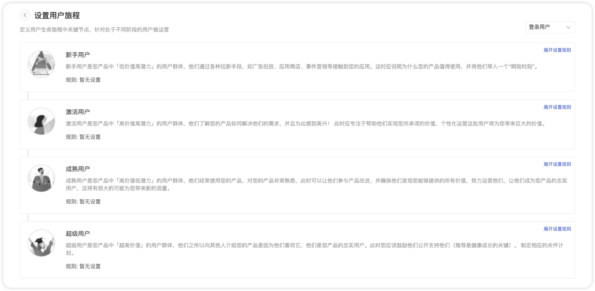
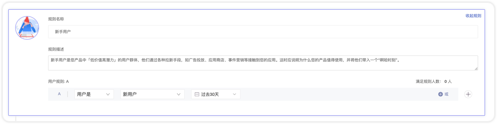
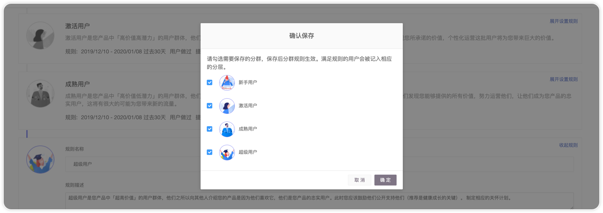
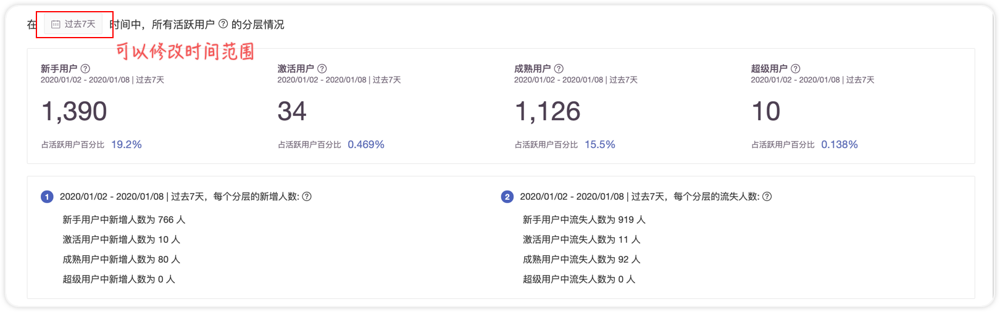

# 用户分层

## 概述

用户生命旅程其实是用用户分层的方法，体现某一时段内来访用户的分层最终状态，让运营者能够清晰的了解在这段时间内活跃的用户中，有多少处于「新手」状态，多少在「激活」，多少「成熟」，多少是「超级用户」。根据当前的用户分层情况，能够制定有重心的运营策略。

## 分层规则

第一次进入该页面可以看到如下引导界面

点击「去设置用户生命周期」红色按钮就会进入到规则制定页面，如下图

点击某一个分层，可以展开该控件，输入相应的规则即可。比如可以设置新手用户的规则为，用户是+新用户+时间段为过去30天，如下图：

规则全部完成后，点击右下角的按钮「保存」，会出现确认规则的弹窗，请勾选需要保存规则并开始计算的分层，勾选后会开始按照目前的规则进行计算。

点击确认，会进入数据详情页面。

## 分层数据

修改规则后需要等待几分钟（通常不会超过1分钟）出计算结果，效果如下图。（如果是第一次制定规则，GIO 可以回溯过去7天的数据来计算分层情况）。通过结果可以看到「过去7天」（允许更改任意时间段）来过的用户分别所处的分层位置。

比如上面的数据可以反映出，大部分来访用户是处在「新手用户」和「成熟用户」，那么运营者可以在「更好激活用户」或者「让成熟用户成为超级用户」上做一些尝试，来提高用户的使用深度和用户生命周期价值。

## 常见问题

### 1 **如何将用户匹配到分层 ？分层之间是否会有重叠 ？**

各个分层之中不会有重复的用户存在，一段时间内，一个人只能处于一个分层。

如上图，S1，S2，S3，S4 代表四个分层（分别对应新手用户、激活用户、成熟用户和超级用户），R1-4代表进入该分层的规则（通常情况下下，用户是从R1开始经历和升级），在匹配某个用户时，优先从上到下匹配，当用户同时满足 R1，R2，R3，R4 时， 该用户属于 S4。

举个例子，某电商产品定义 ：完成了**注册**的用户属于**新手用户**，完成了**首次下单**的用户属于**激活用户**，累计**购买金额超过1000元**的为 **成熟用户**，累计**购买金额超过10000**元的为**超级用户**。假如一个用户，注册当日就下单买了20000元的商品，那么该用户在当日结束后，会处在**超级用户**这个分层内。

### 2 用户分层与用户分群有什么区别 ？

用户分群只能用一组规则划分出一个人群，观察该组规则下人群的特征和人数变化。

用户分层在多组规则之间存在优先级，可以将一群用户划分到各个层级中，方便之后做分层运营。

所以使用用户分群功能并不能做出来用户分层的结果，因为不能保证规则的优先匹配，保证一个人只存在与一个分层之中。

